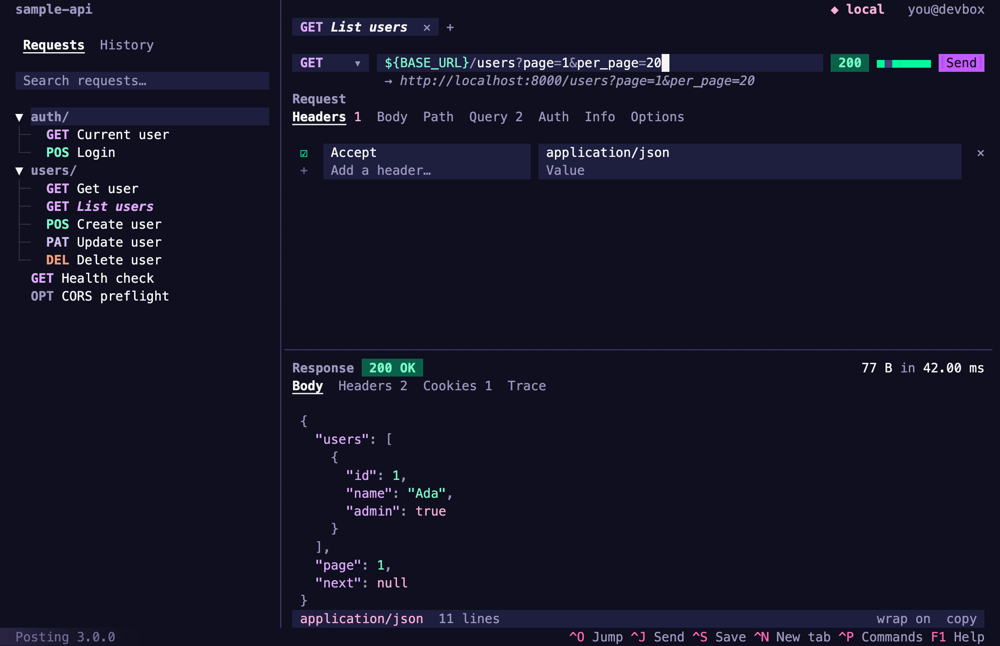

# Posting

**A powerful HTTP client that lives in your terminal.**

Posting is an HTTP client, not unlike Postman and Insomnia. As a TUI application, it can be used over SSH and enables efficient keyboard-centric workflows. Your requests are stored locally in simple YAML files, so they're easy to read and version control.



Some notable features include:

- request tabs, so you can work on several requests at once
- "jump mode" navigation
- layered environments and variables, with a variables screen and autocompletion
- syntax highlighting
- request timing, and a persistent history of responses
- customizable keybindings
- 37 built-in themes, plus user-defined themes
- extensive configuration
- open in $EDITOR/$PAGER
- import curl commands by pasting them into the URL bar
- export requests as curl commands
- import from OpenAPI, Postman and Bruno
- a command palette for quickly accessing functionality

Visit the [website](https://posting.sh) for more information, the roadmap, and the user guide.

## Installation

Posting 3 is in beta. It's a single binary written in Go. Install it with Homebrew:

```bash
brew install darrenburns/homebrew/posting@beta
```

Or download an archive for macOS, Linux or Windows from the [releases page](https://github.com/darrenburns/posting/releases).
Or, with [Go](https://go.dev/dl/) 1.25.5 or newer installed, run:

```bash
go install github.com/darrenburns/posting/v3/cmd/posting@latest
```

Now you can run Posting via the command line:

```bash
posting
```

Coming from Posting 2? Posting 3 reads the same collections, configuration and `.env` files.
See [Coming from Posting 2](https://posting.sh/guide/migrating/) for what's changed.

## Contributing

Contributions are welcome! See [CONTRIBUTING.md](CONTRIBUTING.md) for guidelines. To build Posting 3 from a clone of this repository, run `go build ./cmd/posting`, and run the tests with `go test ./...`.

## Learn More

Learn more about Posting at [https://posting.sh](https://posting.sh).

Posting 3 is built with [Terma](https://github.com/darrenburns/terma). Posting 2 was built with [Textual](https://github.com/textualize/textual).
