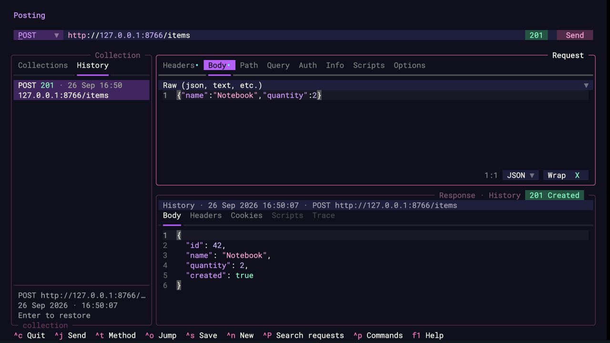
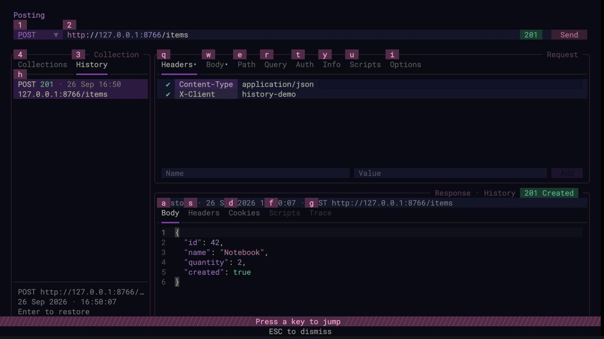
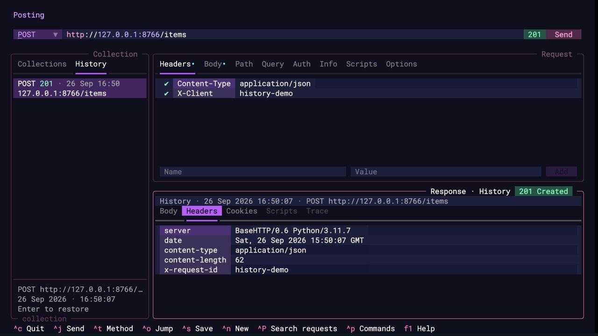
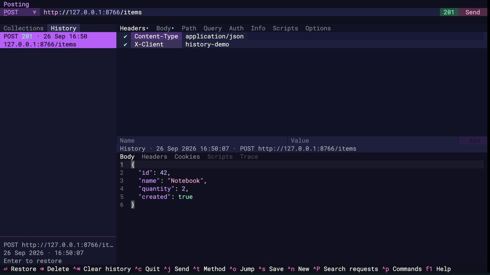
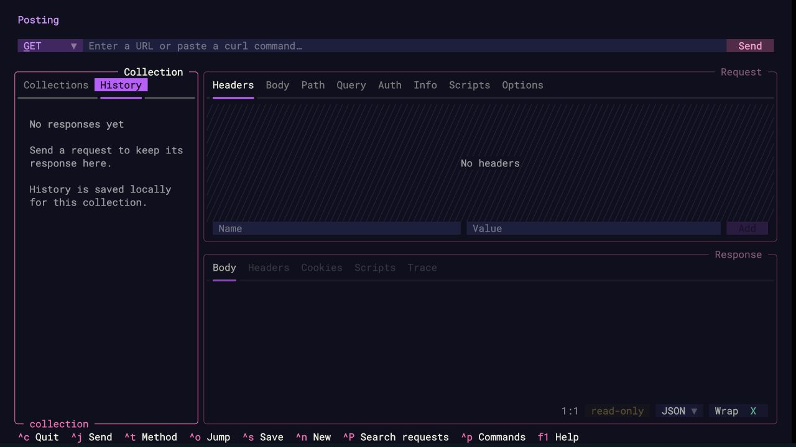

# History verification

Verified on macOS with Python 3.11.7 and Textual 6.1.0.

## Automated checks

```sh
PATH="$PWD/.venv/bin:$PATH" env -u NO_COLOR make test ARGS='-q'
```

Result: **226 passed, 4 skipped** across the Makefile's parallel and serial phases
(225 passed / 4 skipped in parallel; 1 passed in serial). `NO_COLOR` was unset so
snapshots use the application's normal theme.

- Nine storage tests cover persistence, byte-for-byte headers (including repeated
  and non-ASCII headers), binary/compressed bodies, cookies, timing, private file
  permissions, collection isolation, entry/byte limits, deletion, corrupt databases,
  request snapshot immutability, and migration of response-only databases.
- Sixteen feature UI snapshots cover empty/restored states in both spacing modes,
  persistence, full request restoration, live-response transitions, disabled recording,
  deletion/confirmation, narrow/right sidebar layout, storage failures, legacy entries,
  send-time capture before scripts and in-flight edits, and keyboard/jump navigation.
- Additional UI tests check empty/raw/form bodies, disabled form rows, safe detachment
  from a previously open collection file, and restoring/resending missing script paths.
- Existing sidebar snapshots were updated for the tabs and stable sidebar width.
  Standard, compact, narrow, and jump-mode snapshots were rendered and visually inspected.

## Computer-use verification

Ran the real Posting application through `textual serve` and used computer-use keyboard
and mouse actions in the local browser terminal. All HTTP traffic used a disposable
local test server on `127.0.0.1:8766`; screenshots contain only synthetic test data.

The initial response-history checks covered the empty state, HTTP 200/404 entries,
newest-first order, mouse/keyboard selection, and restart persistence. The extended
request-restoration walkthrough used a POST request with a JSON body, custom headers,
and saved request options. The server returned HTTP 201 and a JSON response.

1. Used `Ctrl+O`, `Tab`, `Enter` to load the sample collection request, then `Ctrl+J`
   to send it.
2. Changed the URL editor and used `Ctrl+O`, `3` to activate History.
3. Pressed `Down`, then `Enter`. The original POST URL, headers, body, options, and
   response were restored, with focus left in History and no additional HTTP request.
4. Opened jump mode with History visible and checked its `h` list target and `3` tab
   target. Used jump mode to inspect the restored request body and response headers.
5. Restarted Posting, then restored both panes from disk using `Ctrl+O`, `3`, `Down`,
   `Enter`.
6. Repeated restoration in compact mode.

Deletion/confirmation, missing scripts, original variable expressions, in-flight edits,
and not overwriting previously open collection files are covered by automated tests.

## Keyboard walkthrough

If the sidebar is hidden, first press `Ctrl+H`.

| Action | Keys |
| --- | --- |
| Open History | `Ctrl+O`, then `3` |
| Enter the history list from the tabs | `Down` or `j` |
| Jump straight to a visible, nonempty history list | `Ctrl+O`, then `h` |
| Highlight an entry without loading | `Up`/`Down` or `k`/`j` |
| Highlight first/last entry | `g`/`G` |
| Restore request and response, replacing editor contents | `Enter` or `l` |
| Send the restored request explicitly | `Ctrl+J` |
| Return to Collections | `Ctrl+O`, then `4` |
| Delete one entry / clear history with confirmation | `Backspace` / `Ctrl+Backspace` |
| Show contextual History help | `F1` |

## Screenshots

### Restored request body and response



### History jump targets



### Request and response headers after restart



### Compact layout



### Empty history


