# Posting 2.11.0 release QA

QA performed on local `main` after merging #382, #376, #379, and #377, including
previously merged #374, #366, #368, #354, #380, and #381. The combined feature commit
is `a3da06ede7de5adb22124dadb324e909adfda98c`.

## Computer-use checks

Ran the real app through `textual serve`, using computer-use keyboard and mouse
controls in the browser terminal. All data was synthetic. Requests went only to
a disposable localhost API; environment files and request files were in a disposable
QA collection. No real credentials appear in these screenshots.

- Opened Variables through the command palette, checked token masking, and edited
  `ITEM_ID` from an environment value of `101` to a session override of `999`.
- Switched from development to staging without restarting. A real POST returned
  `environment: staging` and `item_id: 999`, proving the session override survived.
- Completed `${IT}` to `${ITEM_ID}` in the request body using Enter.
- Loaded the exchange through History (`ctrl+o`, `4`, Down, Enter); the original
  variable expressions and response reappeared without another HTTP request.
- Sent a literal JSON body containing `$schema`, `$5`, and `${ITEM_ID}`. The server
  returned those strings unchanged while the environment header resolved to staging.
- Deleted the open scratch request, saved it, then saved again. Its tree entry and
  YAML file returned, with exactly one entry after the second save.
- Opened request search and verified the coloured GET/POST method labels.
- Entered duplicate query parameters in the URL. Both Query rows appeared and the
  real GET response echoed both values.
- Restarted in compact mode, loaded the literal request from persisted History, and
  verified its body, response, headers, and disabled substitution option survived.
- Server logs contained exactly the three explicit sends: POST /items, POST /schema,
  GET /health?q=one&q=two. Loading and restarting did not send requests.
- Follow-up QA checked variable suggestions in both raw and form bodies: loading
  the literal request hid suggestions; enabling body substitution restored the
  dropdown, Enter inserted `$ITEM_ID`, and disabling substitution hid suggestions
  again. These checks used unsaved edits and sent no additional requests.

The browser intercepted `ctrl+shift+v` as paste, so live Variables QA used its command
palette entry. Automated app tests exercise the shortcut directly.

## Automated checks

```sh
PATH="$PWD/.venv/bin:$PATH" env -u NO_COLOR make test ARGS='-q'
```

Result: **317 passed, 4 skipped** (316 parallel, 1 serial), with snapshots
compared against their committed baselines. The built 2.11.0 wheel also imported
successfully in an isolated environment, and Twine accepted both distributions.

The suite includes deterministic snapshots and cross-feature regression tests:

- Editing a session override, switching environments, undoing to the new environment's
  value, and completing a variable introduced by that environment.
- Recording a literal-body request, changing environments, loading History without
  sending, preserving the option, and explicitly resending with the new URL/header
  variables while the body remains literal.
- Raw and form variable suggestions follow the substitution option, including
  toggling it and loading requests. Default suggestions insert expressions that
  resolve on send, and URL suggestions remain enabled. Both body modes have snapshots.

The incoming environment-dialog tests were updated for the submenu route. The
request-search test waits for palette mounting, and the literal-body test waits
for the lazy Options control, to avoid parallel-test timing races.
Changelog conflicts preserve all contributions, and generated snapshots were rebuilt
from the integrated app.

## Screenshots

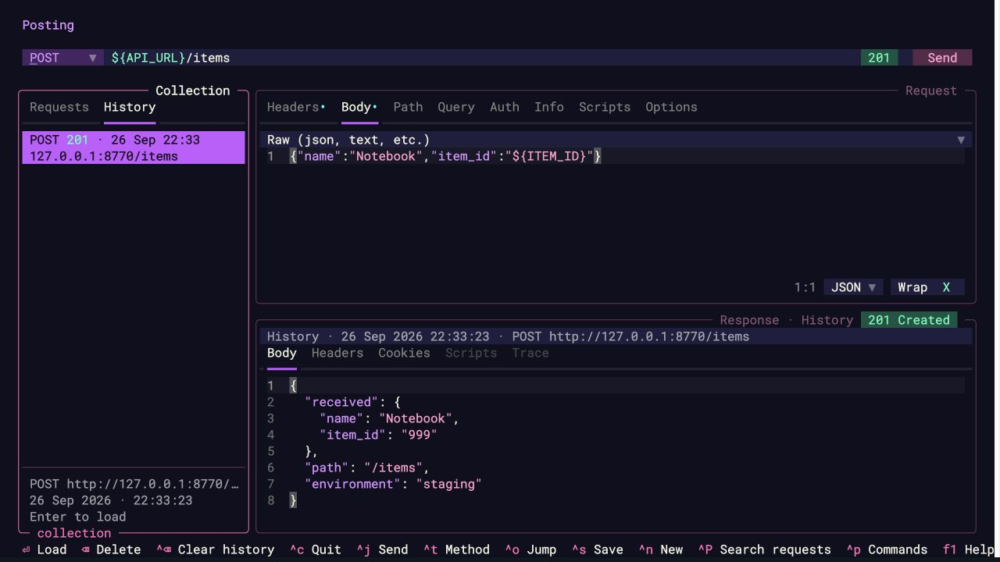
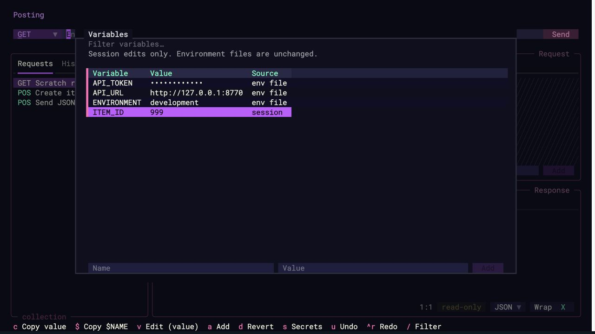
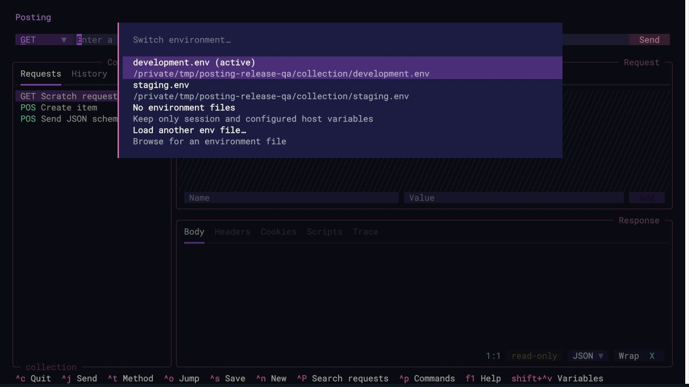
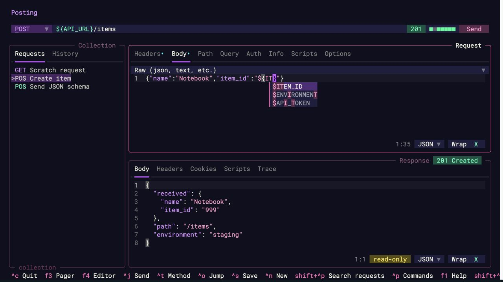
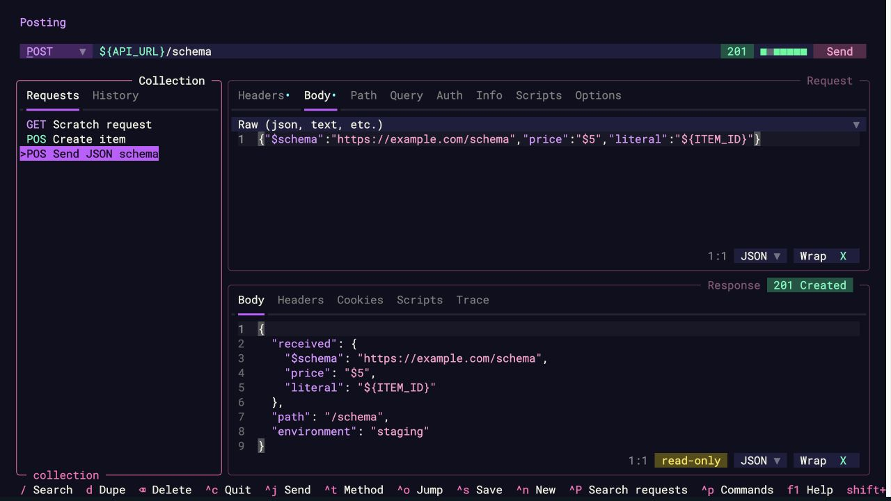
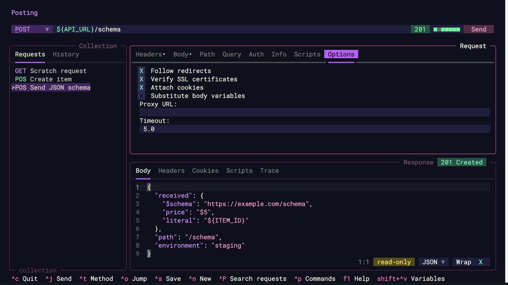
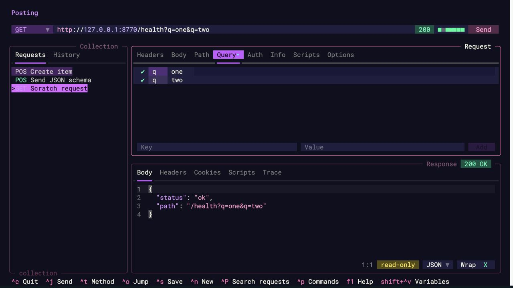
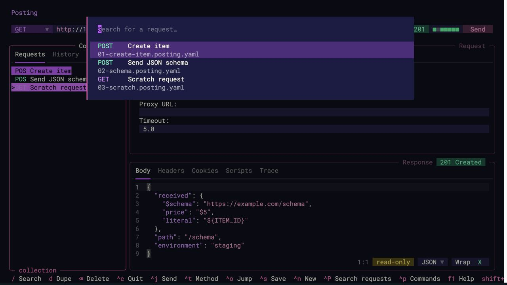
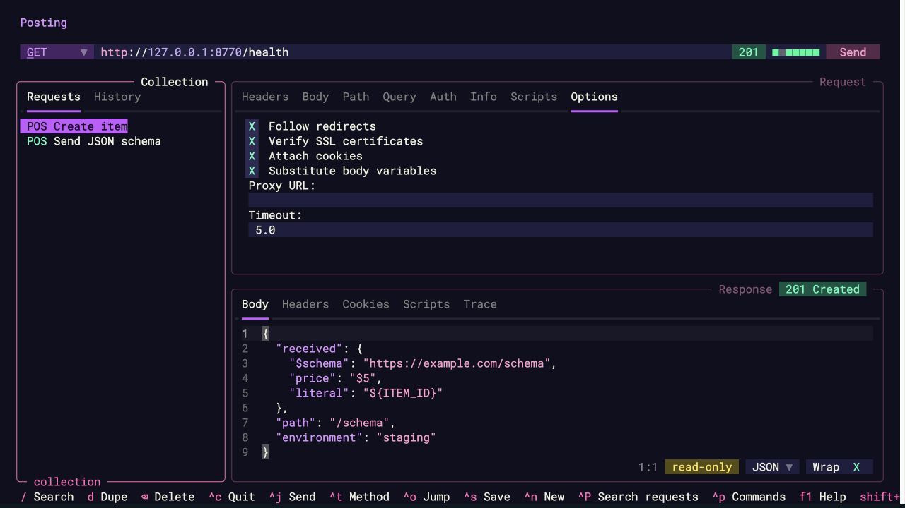
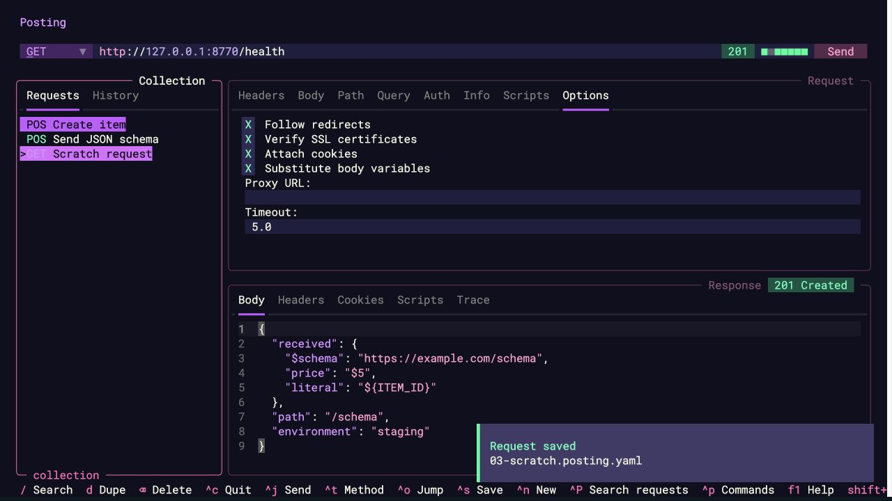
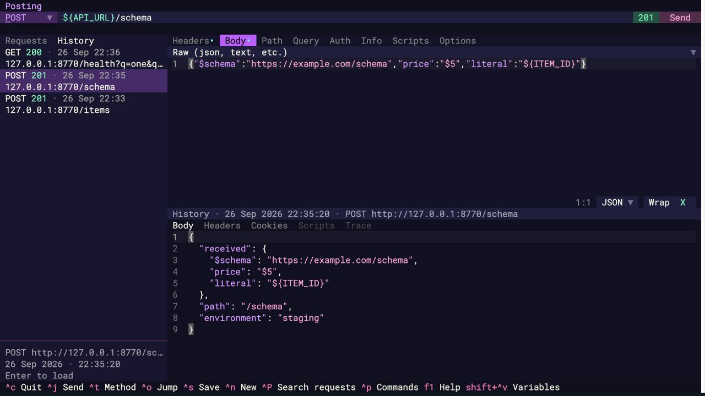
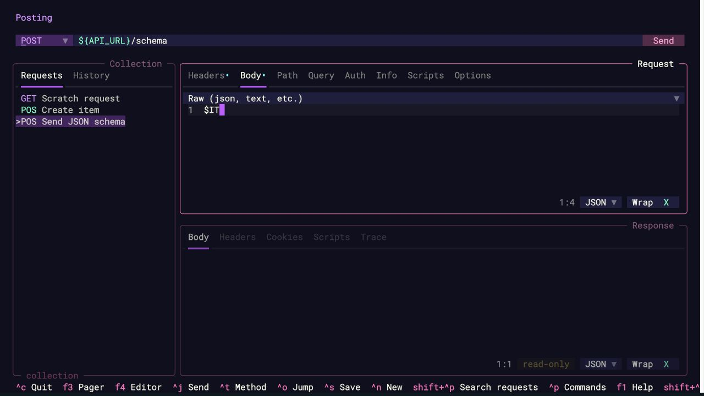
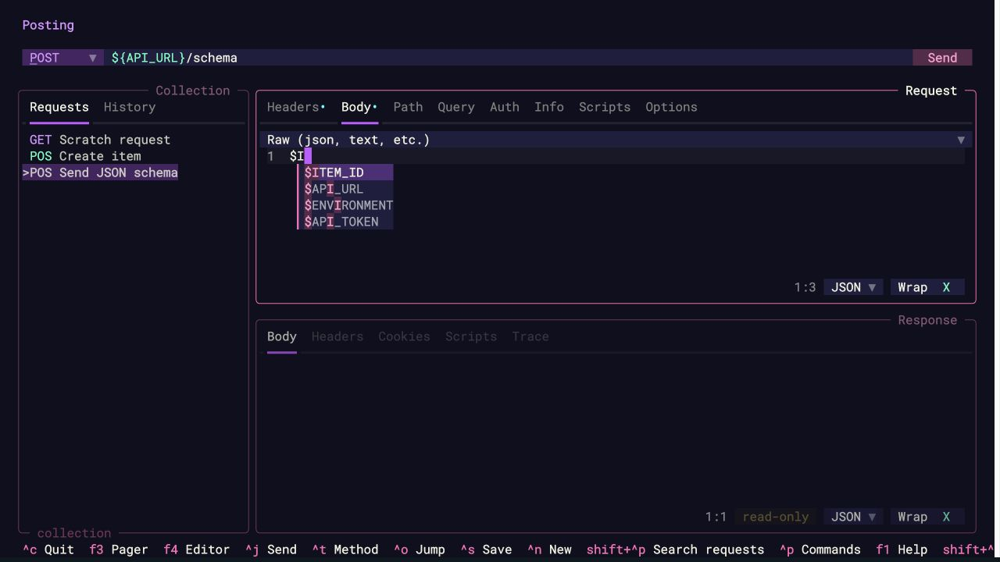
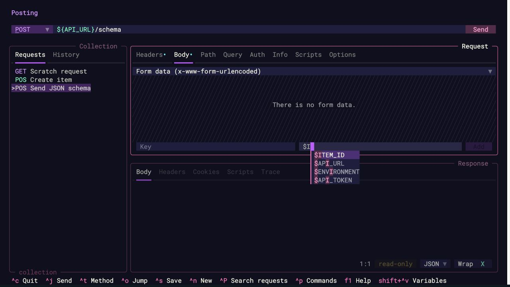
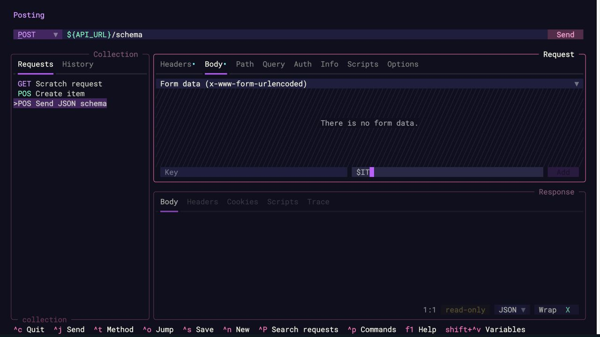

## Changelog audit

Audited every first-parent PR merge since tag `2.10.0`: #374, #366, #368, #354,
#380, #381, #382, #376, #379, and #377. Each has an explicit 2.11.0 changelog entry.
Also checked the previous release boundary and added the missing dependency-group
migration (#341) and contributor-guide link (#327) to 2.10.0.
