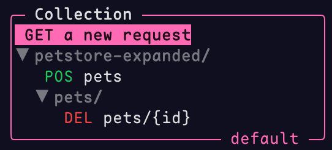

## Overview

A *collection* is just a directory on your file system which may or may not contain requests in the `.posting.yaml` format.

There's absolutely nothing special about a collection.
It contains no "special files" or metadata -- it's just a directory.
It could even be empty.
"Collection" is simply the name we give to the directory which we've loaded into Posting.

## The collection browser

Posting displays the currently open collection in the sidebar.
This is called the *collection browser*.

{ height=300px }

The name of the currently open collection is displayed in the bottom right corner of the collection browser.
In the example above, the collection is named "sample-collection".

You can navigate this sidebar using the keyboard or mouse.
Open a request by clicking on it or pressing ++enter++ while it has focus,
and it'll be loaded into the main body of the UI.
A marker will also appear to the left of the request's title, indicating that the request is open.
A save operation will overwrite the currently open request.

!!! example "Keyboard shortcuts"

    The collection browser supports various keyboard shortcuts for quick navigation. For example ++shift+j++ and ++shift+k++ can be used to jump through sub-collections.
    Press ++f1++ while the browser has focus to view the full list of shortcuts.


The collection browser can be moved to the left or right side of the screen by setting the `collection_browser.position` configuration option
to either `"left"` or `"right"`.

## The default collection

If you launch Posting without a `--collection` argument, it will load the *default collection*, which is stored in Posting's reserved data directory on your file system.

The default collection can be thought of as a *system wide collection*.
It's a place to keep useful requests that you can easily access from anywhere, without having to manually specify a `--collection` argument.

You can check where this is by running `posting locate collection`.
The default collection is named "default", that name will be displayed in the bottom right corner of the collection browser.



This is useful to get started quickly, but you'll probably want to create your own collection directory and load it instead.
This makes it easier to organize your requests and check them into version control.

## Creating a collection

A collection is just a directory, so you can create a collection by simply creating an empty directory anywhere on your file system.

With the directory created, it's time to load it into Posting...

## Loading a collection

If you want to load a collection, you can do so by passing the path to the collection directory to Posting:

```bash
posting --collection path/to/collection
```

### Example

To open a collection (a directory containing requests), use the `--collection` option:

```bash
posting --collection path/to/collection
```

This will recursively find and display requests in the sidebar.
If you don't supply a directory, Posting will use the default collection directory.
You can check where the default collection is by running `posting locate collection`.