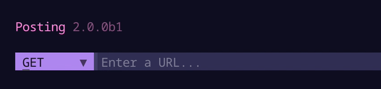

Posting can be installed in a matter of seconds on MacOS, Linux, and Windows.

## Installation

The recommended method is to use [uv](https://docs.astral.sh/uv/getting-started/installation/), which is a single Rust binary that you can use to install Python apps.
It's significantly faster than alternative tools, and will get you up and running with Posting in seconds.

You don't even need to worry about installing Python yourself - `uv` will manage everything for you.

### uv

Here's how to install Posting using `uv`:

```bash
# quick install on MacOS/Linux
curl -LsSf https://astral.sh/uv/install.sh | sh

# install Posting (will also quickly install Python 3.12 if needed)
uv tool install --python 3.12 posting

# Run posting
posting
```

`uv` can also be installed via Homebrew, Cargo, Winget, pipx, and more. See the [installation guide](https://docs.astral.sh/uv/getting-started/installation/) for more information.

`uv` also makes it easy to install additional Python packages into your Posting environment, which you can then use in your pre-request/post-response scripts.

### pipx

If you prefer, you can install Posting via [`pipx`](https://pipx.pypa.io/stable/).

```bash
pipx install posting
```

---

The methods above will both install Posting globally, in an isolated environment. Do *not* attempt to install Posting with `pip`.

??? failure "Homebrew is not supported"

    Installing via Homebrew is not supported, as some of Posting's Rust and C dependencies can take over 10 minutes to compile. When using uv, installation time is measured in milliseconds, and with pipx it's just a few seconds.

<!-- 
On MacOS, you can also install Posting via Homebrew:

```bash
brew install darrenburns/homebrew/posting
```

Note that the Homebrew installation method requires compiling some Rust dependencies, and may take a few minutes to complete. -->


## A quick introduction

This introduction will show you how to create a simple POST request to the [JSONPlaceholder](https://jsonplaceholder.typicode.com/) mock API to create a new user. It focuses on an efficient keyboard-driven workflow, but you can also use the mouse if you prefer.

### Collections and requests

A *collection* is simply a directory which may contain requests saved by Posting.

If you launch Posting without specifying a collection, any requests you create will be saved to the `"default"` collection.

The default collection is a directory reserved by Posting on your filesystem. It's a "global" collection and is not related to the directory you launched Posting from.

This is fine for quick throwaway requests, but you'll probably want to create a new collection for each project you work on so that you can check it into version control.

To create a new collection, simply create a new directory and pass it into Posting.

```bash
mkdir my-collection
posting --collection my-collection
```

Now, any requests you create will be saved in the `my-collection` directory as simple YAML files with the `.posting.yaml` extension.

When Posting opens, you'll see the collection browser on the left side of the screen with `my-collection` displayed at the bottom right corner.

### Setting the request method to POST

When you launch Posting, no request is open, so the UI will look rather empty.

Let's create a simple POST request to the [JSONPlaceholder](https://jsonplaceholder.typicode.com/) mock API to create a new user.

Press ++ctrl+t++ to open the request method dropdown:


The underlined character in each method indicates the key you can press to quickly select that method. We want to send a POST request, so press ++p++ to quickly select the POST method.

### Setting the request URL

You can move focus forward and backward through widgets using ++tab++ and ++shift+tab++ respectively.
So, you can move focus from the method selector to the URL bar by pressing ++tab++ once.

Alternatively, you can immediately move the focus to the URL bar from anywhere in Posting using ++ctrl+l++.

Type `https://jsonplaceholder.typicode.com/users` into the URL bar.


Posting's URL bar highlights parts of the URL as you type, which can be helpful for spotting typos.

It can also autocomplete domains you've previously used, to save you from having to retype them.
For example, if you later want to make a request to `https://jsonplaceholder.typicode.com/posts`, you can simply type "json" into the URL bar and select the URL from the autocomplete menu that appears.



### Adding a JSON body

Press ++ctrl+o++ to enter "jump mode", then press ++w++ to quickly jump to the "Body" tab.
Jump mode is great for quickly moving through the UI without having to press ++tab++ multiple times.

At this point focus is currently on the tab bar itself.
Press ++j++ (or ++down++) to move the cursor down to the dropdown.
Press ++enter++ to open it, then select the option `Raw (json, text, etc.)`.

Move down to the text area below using ++j++ (or ++down++), and type (or paste) the JSON below. 

```json
{
  "name": "John Doe",
  "username": "johndoe",
  "email": "john.doe@example.com"
}
```

Note at the bottom right of the text area, JSON is pre-selected as the content type.
This means Posting will automatically use JSON syntax highlighting and it will insert the `Content-Type: application/json` header for you when the request is sent.

### Viewing keyboard shortcuts

Now is probably a good time to note that you can see the full list of keyboard shortcuts for the focused widget by pressing ++f1++. The text area widget in particular has a lot of useful shortcuts and supports things like undo/redo.

!!! tip "Changing keyboard shortcuts"

    You can remap keybindings in Posting using [Keymaps](../guide/keymap.md).

### Sending the request

Press ++ctrl+j++ to send the request.
This shortcut works globally.

!!! tip "Keyboard shortcuts"

    You may also be able to send the request using ++alt+enter++.
    This only works on terminals that support the Kitty keyboard protocol.


### Working with the response

The response will be displayed in the main body of the UI.
Press ++ctrl+o++ to enter "jump mode", and the ++a++ to move to the response `Body` tab.

Press ++j++ or ++down++ to move the cursor down into the response body.
This text area supports a bunch of different keyboard shortcuts for quickly navigating the response body.
Text can be selected by holding ++shift++ and moving the cursor using the arrow keys (or `hjkl` keys for Vim fans).
You can also select text by clicking and dragging with the mouse.

Press ++y++ or ++c++ to copy the selected text to your clipboard.
If no text is selected, the entire response body will be copied.

!!! tip "Vim keys"

    The response text area supports some Vim-inspired keyboard shortcuts.

    - To select text without holding ++shift++, you can press ++v++ to enter visual mode, and use `hjkl` to navigate.
    - If your cursor is at a bracket, you can press ++%++ to jump to the matching bracket.
    - Press ++w++ to move the cursor to the next word, and ++b++ to move the cursor to the previous word.

    Try experimenting to find out what's supported, and if you're desperately missing something, please start a discussion on [GitHub Discussions](https://github.com/darrenburns/posting/discussions).

You can open the response using the command defined in your `$EDITOR`, `$POSTING_EDITOR`, `$POSTING_PAGER`, or `$POSTING_PAGER_JSON` environment variables.
For example, if you set `$POSTING_PAGER_JSON` to `fx`, then press the corresponding keybind to open the pager when the response text area has focus, the response will be opened in the `fx` JSON viewer.

### Saving the request

Finally, press ++ctrl+s++ to save the request to disk.
Fill out the form on the modal that appears, and press ++enter++ or ++ctrl+n++ to write the request to disk.

!!! tip "Folders"

    Requests can be saved to folders - simply include a `/` in the `Path in collection` field when you save the request,
    and Posting will create the required directory structure for you.
