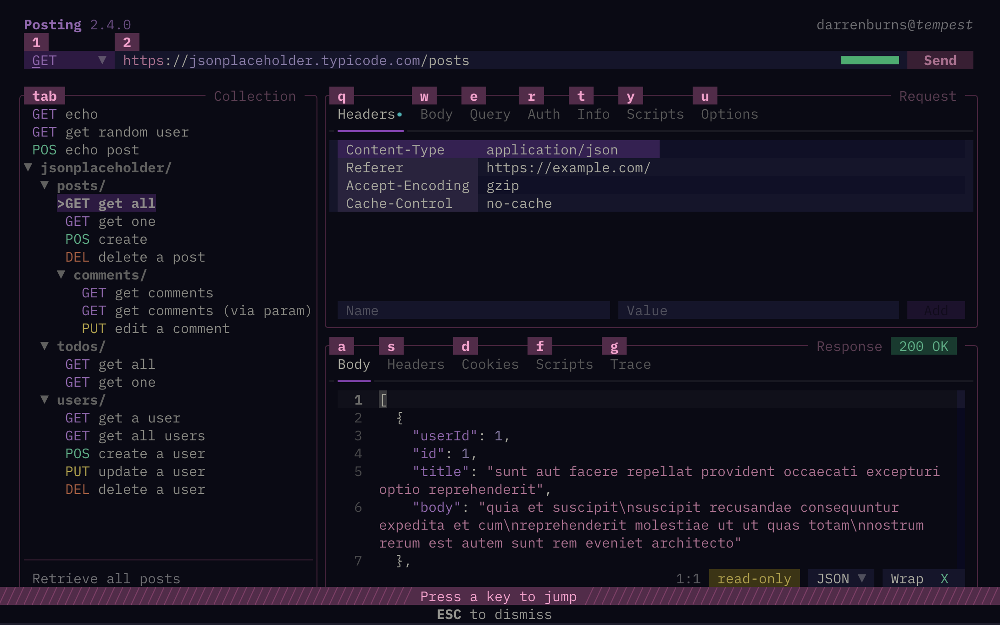
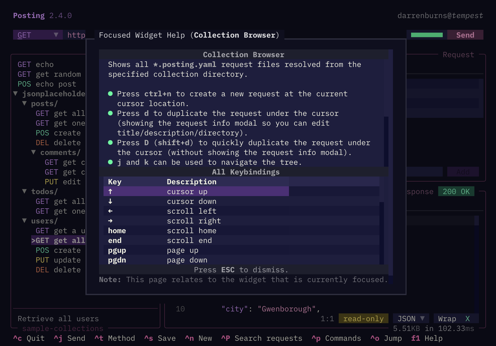

Posting can be navigated using either mouse or keyboard.

## Jump mode

Jump mode is the fastest way to get around.

Press <kbd>ctrl</kbd>+<kbd>o</kbd> to enter jump mode, followed by the key corresponding to the widget you want to switch focus to (jump to).

With the default layout, the positioning of keys on the overlays is similar to the positioning of the keys on a QWERTY keyboard.

To exit jump mode, press <kbd>esc</kbd>.

## Tab navigation

<kbd>tab</kbd> and <kbd>shift+tab</kbd> will move focus between widgets,
and <kbd>j</kbd>/<kbd>k</kbd>/<kbd>up</kbd>/<kbd>down</kbd> will move around within a widget.

Some widgets have additional keybindings for navigation.
You can check these by pressing <kbd>f1</kbd> while it is focused.

Where it makes sense, <kbd>up</kbd> and <kbd>down</kbd> will also move between widgets.

## Mouse navigation

You can also navigate Posting entirely using the mouse, very much like a typical GUI application.

If a widget shows a scrollbar, you can use the mouse wheel or trackpad gestures to scroll through its content.
Scrollbars can also be clicked and dragged.

If you hold shift and scroll using the trackpad or mousewheel, the content will scroll horizontally (if there's a horizontal scrollbar).

## Searching and jumping to requests

Press <kbd>ctrl</kbd>+<kbd>shift</kbd>+<kbd>p</kbd> to open the fuzzy search popup (configurable using the `search-requests` keybinding, see [keymap](./keymap.md)).

Type the name of the request you want to jump to and press <kbd>enter</kbd> to open it.

## Contextual help

Many widgets have additional bindings for navigation other than those displayed in the footer.
You can view the full list of keybindings for the currently focused widget, as well as additional usage information and tips, by pressing <kbd>f1</kbd> or <kbd>ctrl</kbd>+<kbd>?</kbd> (or <kbd>ctrl</kbd>+<kbd>shift</kbd>+<kbd>/</kbd>).

## Automatic focus switching

You can use the `focus.on_startup` and `focus.on_response` configuration options to control which widget is focused when the app starts and when a response is received.

| Config | Default value | Description |
|----------------------|---------------|-------------|
| `focus.on_startup` | `"url"`, `"method", "collection"` (Default: `"url"`) | Automatically focus the URL bar, method, or collection browser when the app starts. |
| `focus.on_response` | `"body"`, `"tabs"` (Default: `unset`)| Automatically focus the response tabs or response body text area when a response is received. |
| `focus.on_request_open` | `"headers"`, `"body"`, `"query"`, `"info"`, `"url"`, `"method"` (Default: `unset`) | Automatically focus the specified target when a request is opened from the collection browser. |

## Exiting

Quit Posting by pressing <kbd>ctrl</kbd>+<kbd>c</kbd>, or by opening the command palette and selecting "Quit".