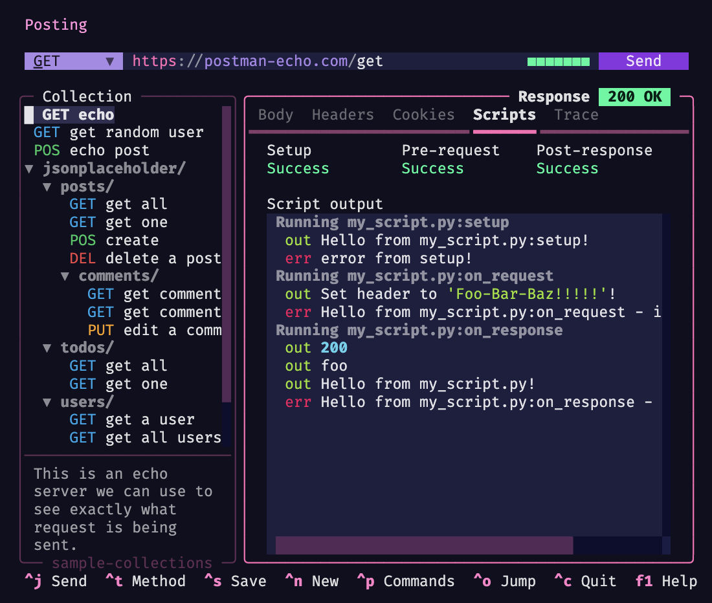

## Overview

You can attach simple Python scripts to requests inside the `Scripts` tab, and have Posting run them at various stages of the request lifecycle. This powerful feature allows you to:

- Perform setup before a request (e.g. setting variables, preparing data)
- Set or modify headers, query parameters, and other request properties
- Print logs and messages
- Set variables to be used in later requests (e.g. authentication tokens)
- Inspect request and response objects, and manipulate them
- Pretty much anything else you can think of doing with Python!



## Script types

Posting supports three types of scripts, which run at different points in the request/response lifecycle:

1. **Setup Scripts**: Runs before the request is constructed. This is useful for setting initial variables which may be substituted into the request.
2. **Pre-request Scripts**: Runs after the request has been constructed and variables have been substituted, but before the request is sent. You can directly modify the request object here.
3. **Post-response Scripts**: Runs after the response is received. This is useful for extracting data from the response, or for performing cleanup.

## Writing scripts

In the context of Posting, a "script" is a regular Python function.

By default, if you specify a path to a Python file, Posting will look for and execute the following functions at the appropriate times:

- `setup(posting: Posting) -> None`
- `on_request(request: RequestModel, posting: Posting) -> None`
- `on_response(response: httpx.Response, posting: Posting) -> None`

However, you can have Posting call any function you wish using the syntax `path/to/script.py:function_to_run`.

Note that relative paths are relative to the collection directory.
This ensures that if you place scripts inside your collection directory,
they're included when you share a collection with others.

Note that you do not need to specify all of the arguments when writing these functions. Posting will only pass the number of arguments that you've specified when it calls your function. For example, you could define a your `on_request` function as `def on_request(request: RequestModel) -> None` and Posting would call it with `on_request(request: RequestModel)` without passing the `posting` argument.

## Editing scripts

When you edit a script, it'll automatically be reloaded.
This means you can keep Posting open while editing it.

Posting also allows you to quickly jump to your editor (assuming you've set the `$EDITOR` or `$POSTING_EDITOR` environment variables) to edit a script.
Press ++ctrl+e++ while a script input field inside the `Scripts` tab is focused to open the path in your editor.

!!! warning
    As of version 2.0.0, the script file must exist *before* pressing ++ctrl+e++. Posting will not create the file for you.

## Script logs

If your script writes to `stdout` or `stderr`, you'll see the output in the `Scripts` tab in the Response section.
This output is not persisted on disk.

### Example: Setup script

The **setup script** is run before the request is built.
You can set variables in the setup script that can be used in the request.
For example, you could use `httpx` to fetch an access token, then set the token as a variable so that it may be substituted into the request.

```python
def setup(posting: Posting) -> None:
    # Set a variable which may be used in this request
    # (or other requests to follow)
    posting.set_variable("auth_token", "1234567890")
```

With this setup script attached to a request, you can then reference the `auth_token` variable in the request UI by typing `$auth_token`.
The `$auth_token` variable will remain for the duration of the session,
so you may wish to add a check to see if it has already been set in this session:

```python
def setup(posting: Posting) -> None:
    if not posting.get_variable("auth_token"):
        posting.set_variable("auth_token", "1234567890")
```

### Example: Pre-request script

The **pre-request script** is run after the request has been constructed and variables have been substituted, right before the request is sent.

You can directly modify the `RequestModel` object in this function, for example to set headers, query parameters, etc.
The code snippet below shows some of the API.

```python
from posting import Auth, Header, RequestModel, Posting


def on_request(request: RequestModel, posting: Posting) -> None:
    # Add a custom header to the request.
    request.headers.append(Header(name="X-Custom-Header", value="foo"))

    # Set auth on the request.
    request.auth = Auth.basic_auth("username", "password")
    # request.auth = Auth.digest_auth("username", "password")
    # request.auth = Auth.bearer_token_auth("token")

    # This will be captured and written to the log.
    print("Request is being sent!")

    # Make a notification pop-up in the UI.
    posting.notify("Request is being sent!")
```

### Example: Post-response script

The **post-response script** is run after the response is received.
You can use this to extract data from the response, for example a JWT token,
and set it as a variable to be used in later requests.

```python
from posting import Posting


def on_response(response: httpx.Response, posting: Posting) -> None:
    # Print the status code of the response to the log.
    print(response.status_code)

    # Set a variable to be used in later requests.
    # You can write '$auth_token' in the UI and it will be substituted with
    # the value of the $auth_token variable.
    posting.set_variable("auth_token", response.headers["Authorization"])
```

### The `Posting` object

The `Posting` object provides access to the application context and useful methods:

- `set_variable(name: str, value: object) -> None`: Set a session variable
- `get_variable(name: str, default: object | None = None) -> object | None`: Get a session variable
- `clear_variable(name: str) -> None`: Clear a specific session variable
- `clear_all_variables() -> None`: Clear all session variables
- `notify(message: str, title: str = "", severity: str = "information", timeout: float | None = None)`: Send a notification to the user

Note that variables are described as "session variables" because they persist for the duration of the session (until you close Posting).

### Execution environment

Scripts run in the same process and environment as Posting, so you should take care to avoid performing damaging global operations such as monkey-patching standard library modules.

#### Libraries

You can make use of any library that is available in the Python environment that Posting is running in. This means you can use all of the Python standard library as well as any of Posting's dependencies (such as `httpx`, `pyyaml`, `pydantic`, etc).

If you install Posting with `uv`, you can easily add extra dependencies which you can then use in your scripts:

```bash
uv tool install posting --with <library-name>
```
